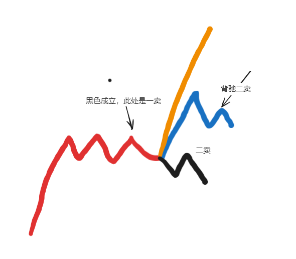

## 今日复盘

最近有些忙，周六周日两天在写量化交易的代码以及小论文，没有开始系统复盘。

最近想赚快钱的念头有些重。运气好在币圈赚了一点，又在股市中凭实力盲目打板亏了回去。好在，迅速浇灭了我马上可以赚快钱的诡异念头。这一经历重新把我的生活重心转移到学习和沉淀上。

同时我明白了打板其实不像我想得那么简单。对于打板而言，选股大于买点。之前我幻想着打板按买点买入，应该是很简单的事，很容易成功。但其实有买点的股票有很多，但是能成功的并不多。真没想到自己会犯这样的错误。可能失败、炸板看得少。但我明白了自己对市场情绪、板块效应、龙头的理解连门都还没入。所以，我决定暂时放下打板和龙头战法，再积累积累。

我的大方向不变，50%仓位的短线和50%的中长线。

未来几天努力学习，暂时先不开仓和复盘。先把手中的票捏好、卖好。

## 明日交易计划

我现在持有工业富联和鸿博股份。

卖点：都是做一笔，等30分钟级别二卖了卖出。

工业富联这样卖：

同理鸿博股份这样卖：

