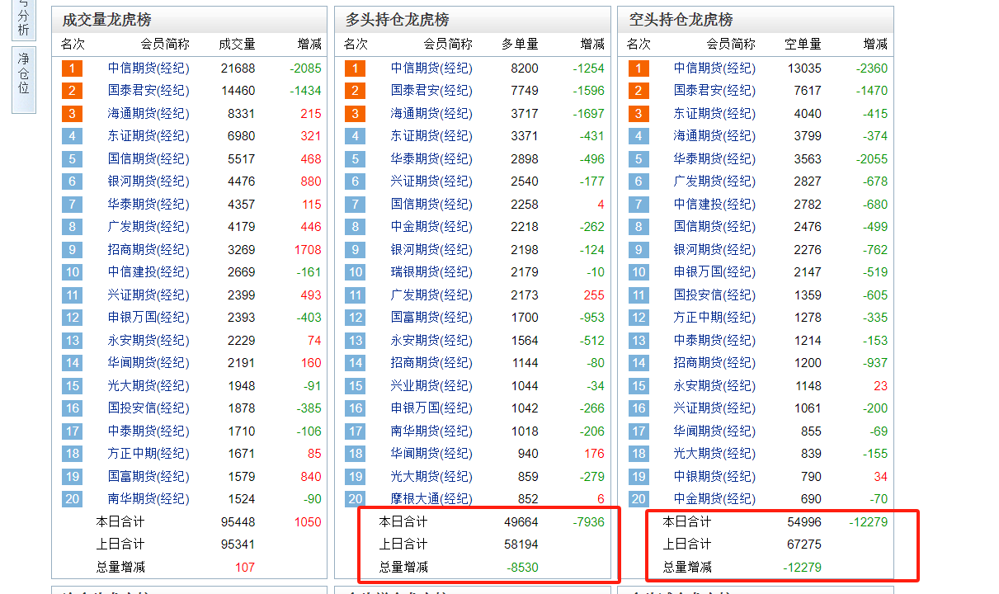

看盘，能让自己清晰的掌握当天市场涨跌情况、资金流向情况、板块轮动情况、龙头切换和延续情况、市场情绪情况、突发事件情况、国家、国际局势情况等等，这些对于股票交易来讲是非常重要的。但盯盘就比较耗费精力，我没那么多时间，所以一般不会盯盘，操作级别也比较大。

复盘，则是对当天市场做一个总结，在看盘的基础上做一个更深入的分析，从而更加清晰地看清市场，做出更合理的操作策略。

**为什么同样的技术，选出来的股票，有的不涨，有的则成为黑马，而大部分人买到的都是不涨的呢？原因就在于纯技术选股太过单一，考虑的因素太过片面，导致纯技术不容易买到黑马。要知道，黑马是在政策支持、庄家操纵、公司自身实力很强等等综合因素下产生的，是需要内在因素推动的；而不是像表面上受到均线支撑或者突破某个压力位那样简单。**

而我们**看盘复盘，看的就是内在因素，复的就是内在逻辑**。 比如盘中某板块异动或者某个股逆势拉升，我们盘中就看到了，那我们可以在盘中，也可以在盘后去分析为什么异动？是不是有政策利好？是不是有消息刺激？是不是有人操纵？等等等等，通过综合的评估后，得出这个板块有没有机会，这个股票值不值得操作，最后才会得出具体的操作思路。

# 如何看盘

## 看盘页面制作

每个投资者都应该结合自身情况做一个适合自己的看盘页面，因为一个好的看盘页面能让自己及时关注到资金流向、板块轮动、个股异动等等重要信息，从而捕捉到比较好的操作机会。

### 主要元素

* 热点板块，把握市场资金最新流向，实时把握热点方向。

* 个股排名，实时把握强势个股情况，结合板块分析，选找机会。

* 综合排名，随时监测各种异动的个股，比如急速拉升，巨幅震荡，量比很高等异动的股票。

* 个股日线图，随时掌握各个股票日线情况，技术情况。

* 筹码分布，观察股票中的资金成本位置以及主力操作阶段。

* 个股分时，把握分时买点，观察盘面异动。

* 大盘分时，实时掌握大环境情况。

* 盘口信息，观察支撑压力、观察主力手法，熟悉股性。

* 分时成交，观察成交异动。

其实只要你用心，坚持看盘一年，你的盘感会得到质的飞跃，但是这对事件自由要求比较高，很多朋友没有这个条件，不过没关系，盘后复盘也是可以的。

## 集合竞价（短线操作方式）

**集合竞价主要找高开的强势个股**

### 基础了解

股票开盘是从集合竞价开始的，集合竞价决定了一天之中的开盘价格，所以集合竞价很重要。

竞价方式分为集合竞价和连续竞价，集合竞价是指对规定的一段时间内将所有合规的买卖申报一次性集中撮合的竞价方式。连续竞价是指在一段时间内连续不停的对接受的买卖申报进行撮合的竞价方式。

竞价原则：价格优先，时间优先。在这个基础上，集合竞价还要体现“成交量优先”，即在符合上述条件的基础上，撮合成交量最大的价格为开盘价，这点经常被主力机构所利用。因此，股价的异常集合竞价往往是庄家利用手中的筹码和资金所为， 而正常的集合竞价结果反应了整体市场的看空或看多。

### 集合竞价的看盘要点解析

9点15到9点20的集合竞价可以撤单，9点20到9点25之间的任何挂单都不可撤销，所以9点20分到9点25分的集合竞价表现比较真实。此时，如果这个阶段的价格呈逐级拉升态势，对应的量能成稳步放大，则说明市场抢筹明显，做多情绪高涨，这种形态最为健康。

在集合竞价过程中，要及时观察盘口，一个真实有效的高开集合竞价，往往它的撮合手数（即成交量能）是在不断的放大，并不是时大时小或者越来越小。另外，在9点25分统一撮合成交后，要在分笔成交中看一下撮合成交的手数（**极少成交数量的高开有效性低、量大的成交高开有效性高，其实可以看做持高开态度的人数或者资金量**），可以结合该个股的流通盘来综合判断。

* 流通盘小于一个亿，撮合成交要在300手以上
* 流通盘1-5亿，撮合成交要在500手以上
* 流通盘5-20亿，撮合成交要在1000手以上
* 流通盘20亿以上，撮合成交要在2000手以上

### 集合竞价看盘前的准备工作

一年之计在于春，一日之计在于晨。作为一个合格的投资者，在交易开始之前，往往必须要了解方方面面的财经信息，特别是会对市场产生重大影响的事件。比如国家产业政策，外围市场涨跌，大宗商品，国际局势，利率调整等做详细的了解和分析，以更好的预测和把握市场。就集合竞价之前，我们需要了解的信息如下：

* 浏览主要财经网站，了解主要市场信息。主要网站有东方财富网，中国财经信息网，上海证券报，中国证券报，慧博投研咨询等。

* 了解隔夜欧美主要市场的走势，欧洲主要看德指和英国富时，北美主要看道指，亚洲主要关注日韩走势。

* 了解隔夜大宗商品（有色、煤炭、农产品、原油、黄金等）信息，以上品种信息均可以通过文华财经软件或者东方财富看。

* 通过软件主图上的“信息地雷”了解重要标的股或持有股的行业信息、个股公告等。

### 集合竞价直击黑马（选股）

在集合竞价选取强势黑马个股时，要符合如下八大特点。

* 个股的60、120日中长期均线向上，中长期趋势走好，且5、10、20也开始多头排列，整体方向是向上的股票。最好处于上涨初期或者主升浪阶段，用缠论结构来看，日线最好处于上涨线段，周线处于买点延续。

* 跳空高开后，在前期的这一价格区间上没有或者少有结构压力位、筹码密集区，前高点的心理压力位等阻力因素的存在，同时也不要有中长期均线压制，最好有形态真空区或者筹码真空区。因为压力位附近的跳空高开很多是试盘，一旦抛压大会继续吸盘，没有压力的好处一是有拉升空间，二是抛压比较小，拉升相对轻松且持续。

* 个股集合竞价的成交金额要大，量比至少3倍以上，往往要达到10倍以上，有时高达30倍甚至100倍以上。虚拟成交量要大。

* 跳空高开之前，最好要经过放量上涨到缩量下跌再开始放量的过程，量是验证，是根本。

* 就跳空高开的次数来讲，最好是第一次跳空高开，以求安全性。

*就股性而言，之前要有大阳线或者涨停板出现，个股有涨停板基因。

* 当个股拉深一波有相对的涨幅后，在高位的高开要谨慎小心，存在在早盘高开，拉出价格空间，然后向下疯狂出货的嫌疑。

* 跳空高开幅度可以分为3种：高开2%以下为小幅高开，2%-5%为大幅高开，高开7%以上的为巨幅高开，高开幅度越大，则多方表现越强，上涨动能越大。但是如果当天高开太多的话当天介入利润空间已经太小，同时如果高开不多的话则多方实力值得商榷。所以正常情况下要选高开2%-5%的个股进行短线狙击。（当大盘以及板块处于牛市行情，并且个股形态相对强劲，则可以介入巨幅高开的个股，往往后面会有相对强势的上涨。）

* 补充，牛市和震荡市的高开可以做，下跌趋势的熊市中不可以做。

### 集合竞价实战选股（9点25分开始做）

在进行集合竞价直击涨停板的实战操作中，必须首先保证大盘处于多头行情中，至少是震荡市，熊市不建议操作。在此前提下，按照如下几个步骤进行选股。

* 按顺序依照涨跌幅、量比、涨速来观察。

* 着重观察高开2%以上的个股，特别是2%-7%的个股，一般在第一个页面选找即可。

* 把2-7的股票选出来然后放到自选或者新建一个板块，再进行第二步，把量比大于2的选出来，速度要快，这一步是选出来放量高开的股票，是有可能上涨的股票。

* 个股形态筛选，把趋势向上，没有压力或者压力被消化过的选出来。

* 观察对应的版块有没有高开，如果板块也高开，那极有可能是板块效应，要重点关注，因为个股的强势加上板块效应，非常容易成功。

* 选优，两壁最大的和有板块效应的个股打5日、10日或者20日均线支撑炒作。

## 分时分析

* 第一个十分钟：多空双方之所以重视开盘后的第一个10分钟，是因为这是一天的开始，众多投资者早上都在观看开盘分时走势，且会根据分时走势做出跟风行为。而刚开盘时，大部分投资者都在观望，参与交易的投资者还不多，此时盘口挂单密度往往比较小，买卖量不是很大。所有主力机构可以利用不大的成交量（资金），来引爆跟风行为，起到四两拨千斤的作用。

* 第二个十分钟：多空双方会进入到休整阶段，一般会对第一个10分钟的趋势进行修正。如果多方拉的太猛，空方抛盘则会涌出，如果空方抛盘太猛，多方则会组织反击，这个时间段经常是多空博弈的转折点。

* 第三个十分钟：此时，参与交易的人越来越多，买卖盘变得实在，早盘集合竞价和开盘后第一个十分钟有可能存在的虚假交易成分较少，可信度较大（有的主力机构会在集合竞价和刚开盘得时候进行虚假交易，比如试盘、出货之类的），这个时间段内得走势大概可以确立全天得走势方向。比如十点的时候走势处于上涨，那当天基本可以判断要正向运行。

* 核心提示：在开盘后的前三个十分钟后，若分时走势走出低点抬高，高点创出新高的正向走势，且量能有效放大验证，大盘分时合力向上或者个股白线运行于黄线上方且黄线不断向上，则当天走高的概率较大。反之当天下跌概率较大。（大盘向下或者庄股恶意操纵等非正常运行的除外。）

* 开盘后第二个30分钟：多空双方在经过开盘后第一个30分钟的激烈博弈以后，基本确立了当天的走势，但是仍然需要进一步巩固这一成果。如，若多方在第一个30分钟顺利的走出上涨走势，则随后的第二个30分钟往往要观察分时的低点是否会破位早盘上涨过程中分时回调的次低点支撑。若股价始终运行在次低点支撑上方，说明多方在第一个30分钟得到的成果得以巩固，反之表明多方没能巩固前30分钟打下的成果，表明市场依旧存在变数。

* 上午收盘和下午开盘：上午收盘和下午开盘这两个时间点也是多空双方必争的。上午收盘时对上午交易2小时的总结，又称“小收盘”，主力往往会借此吸引眼球。而下午开盘也至关重要，在中午短暂休息后，投资会对上午盘面走势做充分的分析和研判，所以在下午开盘时往往会有较为明显的震荡走势，反映的就是多空双方的内心博弈，下午开盘又称“小开盘”。

* 下午14点-14点30分：在经过三个小时的博弈后，在这一时间段，散户投资者略有乏意，思想逐步麻痹，此时距离收盘仅有不到一小时事件，主力机构要做出当天想要的结果（阴或者阳），往往会出其不意，朝着自己计划的方向强势操盘，或者拉升或者打压，拉升的第二天以上涨居多，打压的第二天以下跌居多。

*收盘前的异动：每天在收盘前，因为时间紧张，不容许投资者有太多的考虑，主力往往借此机会主动做盘。可以花费较少资金达到改变股价和技术指标走势的目的。如处于低位拉升，便于第二天冲高快速脱离成本去，处于高位下跌，则有疯狂出货的嫌疑。

**以上内容具有一定参考性，但并不是100%准确，实际中应该灵活看盘。**

## 开盘分类及性质

开盘价是众多投资者深思熟虑一晚上后的竞价结果，如果没有重大的消息影响，股票的开盘价往往与昨日持平。若开盘价高于或者低于昨日收盘价，则分别代表投资者对该股票的一致看多或者看空。

1. 高开

* 下跌中的高开：不管大盘还是个股，如果其中长期趋势和中短期趋势均处于下跌通道中，则往往会高开低走，每次的高开都是出逃的机会，此时不要有太多的幻想。

* 拉升过程中的高开：当趋势处于多头拉升过程中，高开表明多头的强势，此多为上升过程中的跳空缺口且会高开高走，此时要敢于狙击主升浪，当然，弱大盘或者个股拉升相对涨幅后，在高位的高开要谨慎对待，因为高位的高开有可能是庄家借机拉升出货。

* 震荡市中的高开：若大盘或者个股处于震荡区间的下轨，则可以考虑短线介入；但若市场高开后，处于震荡区的上轨压力区间，则要谨慎小心，提防高开低走，此时不妨暂时等待观察，看是否突破再做打算。

2. 低开

* 下跌途中的低开：不管是大盘还是个股，如果中长期趋势和中短期趋势均处于下降通道中，此时低开表明空方力量再次发泄，投资者必须出局以躲避风险。

* 拉升中的低开：不论个股还是大盘，如果中长期趋势和短期趋势均处于上升通道中，低开往往是暂时的，此时的低开一般是刻意的洗盘所致，市场多头往往会快速入场，走出低开高走的走势。

* 震荡市中的低开：若大盘或个股处于震荡区间的下轨，低开则意味着有可能会破位，投资者必须警惕；若处于震荡区间的上轨，低开则意味着短线调整的开始，投资者同样要小心。

## 扫描期货与现货指数

大盘是方向，个股是工具。影响个股涨跌的因素有很多，如业绩、庄家操纵、板块、大盘、题材、消息、政策等等，而其中大盘因素是所有因素中最主要的因素，市场中95%以上的个股走势与大盘高度一致，即大盘上涨个股也是上涨，大盘下跌个股也会同步下跌。所以，我们判断个股涨跌首先要判断大盘涨跌。

而大盘指数又高度受股指期货的影响，因为股指期货具有提前发现价格的功能。所以，为了能更加准确的判断大盘，我们在每天看盘的时候，必须同时兼顾到股指期货的走势。具体目前我国的金融期货标的指数有三个，即沪深300指数（IF300）、上证50（IH50）和中证500（IC500）指数，每个标的的指数对应4张合约，即当月合约、下月合约及随后两个季度合约。这四个标的的指数因其编制时选取的成分股不同，故其代表市场风格也不同。沪深300指数走势代表的是沪深前300支个股（按一定规定选取并每年更换成份股）的走势情况，可以简单地理解为大盘蓝筹股走势；上证50指数走势代表的是上证50成分股的整体走势，可以简单地理解为超级大蓝筹的走势；而中证500代表的是中证500成分股的整体走势，可以简单理解为中小盘个股走势。

**在投资市场中，要想站得高看得远，掌握整个市场走向，把握市场大的格局，必须及时了解上述三大期指标的和四大常规指数，即IC合约、IH合约、IF合约、上证指数、深证成指、创业板指、中小板指。我们应该把这七大指数建一个板块，集中观察。**

建立7大指数并扫描他们的作用：

* 根据期指标的指数的走势提前预测未来市场走势。

* 根据各大板块的量价关系、指数走势来判断市场风格，如常规所说的蓝筹行情还是中小板行情。

## 扫描8大权重板块

众所周知，上证市场在中国证券市场中权重占比是比较高的，其主要上市公司为中字头蓝筹股比较多，具有举足轻重的作用（近些年来，由于产业的没落，新经济不断上升，深圳市场的权重在不断同步提升。）所以预测上证市场走势对操盘的成败起到了至关重要的作用。而上证指数传统上由八大权重影响，即：银行、保险、券商、石油、有色、煤炭、钢铁、地产。我们应该把这八大权重板块集中在一起分析，因为这8大权重的走势就决定了上证指数。

建立8大权重板块的作用有：
* 根据8大权重板块的走势可以基本判断上证指数走势。

* 根据各8大权重的走势强弱对比，投资者能清楚地寻找强势板块进行狙击。

## 扫描各板块排名

个股在运作时，其不但处于整个大盘的大环境中，同时还处于整个板块这个小环境中。“板块效应”不单是中国特色，就连发达国家地所谓价值投资市场同样存在着“板块效应”。在中国炒作之风成风盛行地情况下，板块涨跌的板块效应对个股涨跌的影响是巨大的。如最近的注册制概念、高送转概念、年初的新冠概念、去年的猪肉、华为等概念。

所以，在每天看盘时，都要及时地了解个行业板块涨跌幅排行，这样才能及时的抓住市场热点，紧跟市场风口。

## 扫描沪深涨速排行

前文中，看盘模块中有一个综合排名，其中包括了沪深两市涨跌幅、涨速、跌速、还手、成交额等的排名，而其中的涨速排名可以用于捕捉快速起涨的黑马个股，同时也可以窥探某一板块的异动。

**具体方法是：当盘中发现某只股票突然直线拉升，进入沪深涨速排名前列，则必然有大资金介入，此时要快速浏览个股技术形态，包括趋势**

均线、量能、板块、概念、消息等（要有深厚的基本功才能快速在较短时间内做出正确的判断），若符合要求则可以盘中强势狙击（追涨或分时回档即介入，安全起见，最好等分时回档）。若此时个股涨幅较大，如超过7%甚至涨停，则可以快速浏览其板块“兄弟个股”，并强势狙击。如果盘中错过了龙头，那选板块内的其他强势个股也是可以的，错过老大，做老二。

## 扫描龙头

纵观中国市场的每一波行情，都是在题材概念的带动下起涨的，这些在市场中能呼风唤雨的版块对市场走向和人气影响都是巨大的。所以，为了能更好地监测市场，及时把握市场的风向标及人气，需要把市场中的领头羊个股专门建一个板块，命名为龙头来集中观测。若在上涨一波后龙头个股集体倒下，则整个市场的上涨就要告一段落；若在市场调整过后，突然众多龙头个股在盘中集体飞舞，则表明市场调整结束，可以快速布局，可以说龙头个股在整个市场中是嗅觉最敏锐的，对我们市场风向的把握有着极其重要的作用。

* 注：龙头个股最好兼顾市场中各个题材概念龙头，这样会更具有代表性，同时把握市场的最新风向时会更准。

# 如何复盘

## 期指多空持仓分析
股指期货自2010年4月16日诞生以来，因其“提前发现价格”功能的存在，无时不在影响着指数走势，对现货市场造成了较大的影响。所以，我们平时在现货市场操作的时候，必须要对期货市场做到全面的了解，以更好更精准地预测、把握市场，在对期指分析的时候，首先要了解目前期指市场（IH合约、IF合约、IC合约）的多空双方持仓及加减仓情况。数据可在东方财富官网去找。

期指多空持仓量变化查询步骤：打开东方财富官网——找到数据中心点击进入——点击期货期权——点击股指期货持仓——然后就会有三个股指期货合约持仓比例图。

* 我们一般看多头和空头增减仓位情况，分析多头持仓和多头持仓的差值，若多头持仓多余空头，则做多意愿强烈
* 分析市场当前多头增减仓与空头增减仓的差值，了解多空力量的变化情况。

经过上述分析后，就掌握了当前期指市场多空双方力量的对比情况，虽然此对比结果并非完全与最终多空博弈结果相符合，但是对分析和预测现货市场走势有一定的参照作用。

## 期指技术分析

除了上述对当天期指多空持仓及多空增减仓的分析外，还要对三大期指当月合约做全面技术分析，了解和掌握如下信息。

* 对各期指当月合约的日线、60分钟、30分钟甚至15分钟线技术走势做详细分析，看均线走势如何，macd如何，形态结构如何，是否处于可操作区间，操作与不可操作的标准以自己的操作方法为主。若期指处于可操作区间（针对做多），那么现货市场可以放心做多；若期指处于不可操作区间，那么现货市场也大概率处于不可操作区间，需要轻仓或者空仓对待。

* 因我国权重与中小创走势经常分化的特点所致，三大期指走势虽然大体相同，但是有时相差也比较大。在复盘分析时，要注意IH、IC、IF合约的对比，可为我们的投资方向或者规避方向提前做出预测。例如：若IH合约和IC合约均处于可操作区间，但是IH合约表现平平，而IC强劲，技术上远强于IH合约，此时投资者应该明白市场的方向不在权重，而在中小创题材类个股；反之，若IC合约暴跌，而IH合约逆势上涨，则投资者要明白现货市场要发生“二八现象”，即权重上涨，中小创题材下跌或者不涨，投资者要及时规避中小创类个股，而可以适当找机会操作权重股。

* 通过对期指近期合约、远期合约做对比，了解投资者对市场未来怎么看。比如，若远期合约远远低于近期合约点数，说明不看好未来，则会影响近期合约和现货市场走势。

## 各大指数分析

大盘是方向，个股是工具。个股因处于整个大盘的操盘环境中，所以其涨跌往往要看大盘的脸色，若大盘向好，则95%的个股全部向好；反之亦然。所以，对大盘的分析就显得尤为重要。

就目前来讲，沪深两市共四大主板，即上证指数、深圳成指、创业板指、中小板指。每天盘后复盘时要详细分析。

* 对各大指数均线、量价、新闻、各周期、macd等做详细全面的分析。看是否处于可操作区间，可操作区间和不可操作区间的标准以自己的操作方法为主。如果处于可操作区间，则放心操作个股。反之注意风险，及时调整仓位。

* 对四大指数做对比分析，判断市场风向在哪里，及时、精准的确定领航板块。

## 外围市场分析

随着中国资本市场的壮大和中国经济不断融入全球化进程的加快，中国A股市场与全球其他资本市场关联度逐年提高，所以，想要做好A股，必须还要对外围市场做到了解。鉴于对外围市场信息的匮乏，作为普通投资者，做到粗略的技术分析即可。

## 行业概念板块分析

“着眼大局，着手小处”讲的就是我们在平时研究分析时要从大到小，这样才不会犯方向性的大错误，以确保大方向正确。具体分析顺序是大盘——板块——个股，板块紧随大盘之后。尤其在中国“羊群效应”更为明显，对板块的选择显得尤为重要。在通达信中，板块被分为：二级行业板块，概念板块，风格板块。

具体分析时，尤其重视行业板块和概念板块的分析，分析步骤如下：

* 每天把所有行业板块和概念板块按丈夫排列榜排列，一一分析。

* 通过成交量、均线等技术指标对比各板块强弱和未来潜力，如若近期某一板块持续放量，蓄势充分，且位置不高，则必定要多加关注。

* 通过阶段性涨跌幅排名对比来分析各板块强弱。

* 把涨幅居前的强势板块中的3-5名个股做详细分析，一般来讲，此类个股均具有龙头特征，把此类个股放入自建的观察板块中，后期跟踪观察。

## 形态板块分析

所谓形态板块是指，同一大盘环境下，个股因其所处运作阶段的不同而形成不同的形态，某一批形态类同的个股因其运作阶段类同，所以在股票价格涨跌也出现高度类同的现象，此为所谓的形态板块。而这些不同形态的版块在市场中往往会有轮动表现，此即形态板块轮动。

研究形态板块的好处在于能及时抓住市场形态轮动的方向，比如当某日涨跌幅居前的个股全部是近期底部长期横盘的个股，则表明这是市场的一个方向，作为投资者可立即寻找其他底部长期横盘的个股做潜伏；再比如某日所有高位个股集体暴跌，投资者则要引起警惕，若手中持有高位的个股时，此时下跌也是大概率，可因此提前清仓出局，落袋为安。具体分析的方法很简单：

每天把涨跌幅前100名和跌幅前100的个股快速翻看一遍，即明白市场的涨跌的基本动向。

## 板块资金流分析

**市场的涨跌皆因资金的流进流出**所以，在做市场分析时对资金流的研究也是一个重要的方向。但是资金流的研究切勿周期太短（如一天的上涨资金流进，第二天下跌资金又流出，这种短期的资金流没有太大意义），要研究在一段时间内资金的总流入流出情况，这样才有实际意义。具体研究资金通过几个途径。

* 通过通达信的“资金推动力”，查看各板块（行业或者概念板块）在当日的资金流流入流出情。

* 东方财富的资金流向功能

* 通过财经网站查看，比如东方财富网。

分析板块的时候，大家可以使用量能潮指标（OBV）辅助分析。

OBV简单用法：OBV指标是一段时间内阳量相加减去阴量的结果，OBV指标是分析买卖量的一种指标。一般情况下，如果股价长期横盘，而OBV不断抬高，说明股价和OBV发生背离，说明不断的有资金在股价横盘直接入场，一般后面股价会上涨，股价横盘从OBV指标来看，就是蓄势的过程。

## 龙头动向分析

文章中段部分讲了，如何去建立龙头板块以及建立龙头板块的好处。其中讲到通过阶段性涨跌幅排名、股性强弱、板块带动力等方式建立龙头板块，然后密切跟踪关注。而建立龙头板块的好处在于不但为我们的具体操盘建仓服务，还有就是通过龙头板块中的龙头个股动向判断大盘温度。众所周知，市场的每一波行情都必然有几个龙头板块或N只龙头个股带动，若当龙头板块或个股倒下时，往往意味着大盘的一波上涨进入末期，这是判断市场温度的一个重要因素。投资者由此可以春江水暖鸭先知，可以提前介入，同时也可以及时提前撤离。

## 个股精选与指定操盘计划

根据自己的方法选取需要的个股，或者根据文中的一些思路精选个股。然后制定出严格的操作计划去执行操作。

**投资者每天还应该浏览大量的财经信息，财经信息可以在东方财富或者同花顺等渠道看**

以上就是股票看盘和复盘的方法，流程，脉络还是比较清晰的，不会看盘和复盘的可以参考参考。当然，看盘和复盘需要很多经验和知识积累，但是这些都要去做了才会用。

去做不难，难的是坚持，比如就这篇文章说的方法，很多朋友看了以后因为新鲜感，可能坚持一两天，但是能坚持一年的可能就没有了。

其实，**交易最后做的就是自己的习惯**，自己的习惯都是在平时养成的，比如看盘、复盘、分析、学习等等，都是习惯。不过，一个好习惯的养成，需要毅力、需要坚持。

