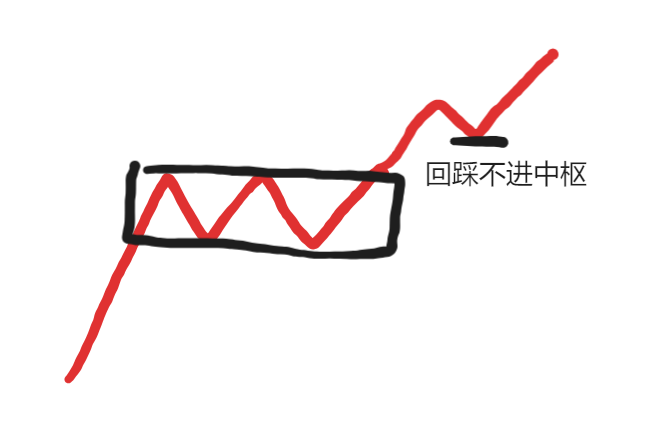
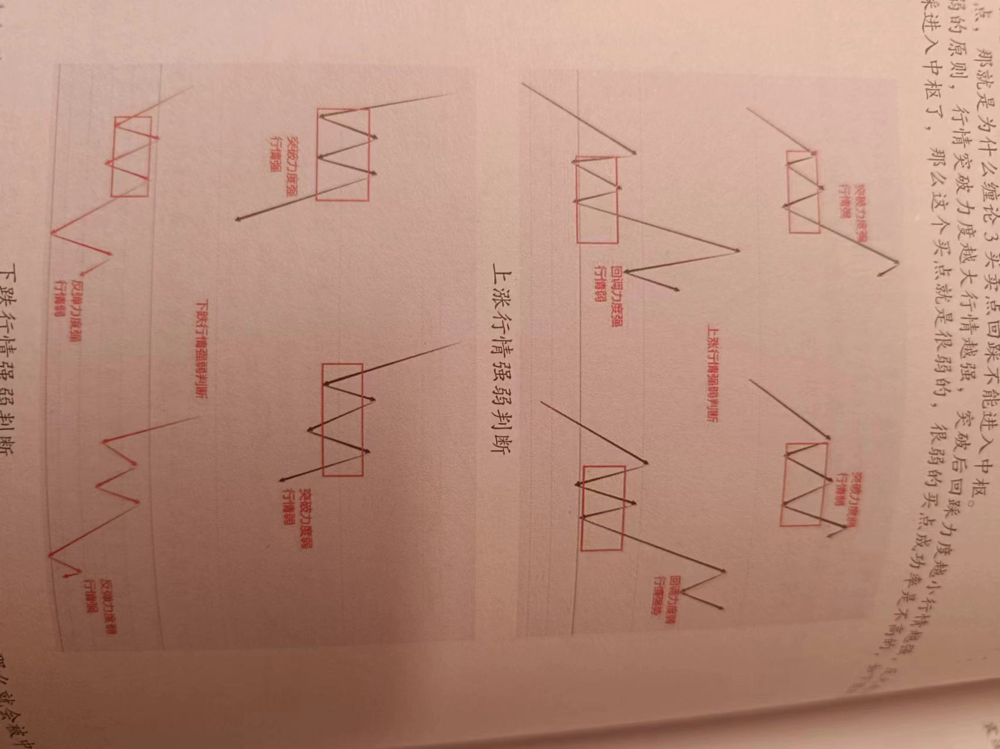
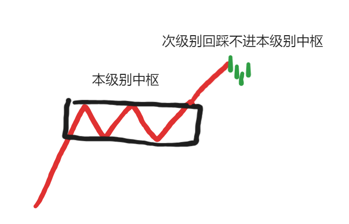
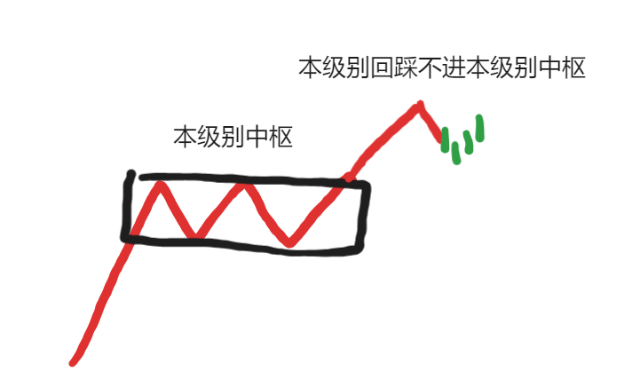
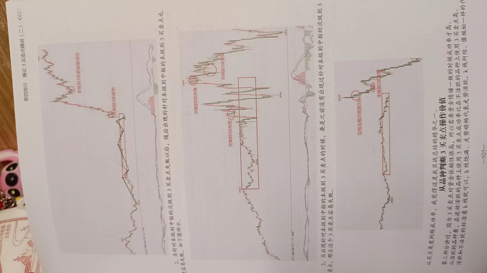

# 白仪三买卖点总结

## 三买卖点形态

三卖反之

## 三买卖点逻辑介绍

从形态上我们可以看出来，找3买卖点，关键在于中枢，因为3买卖点是需要突破中枢以后才会出现的。

为什么中枢这么关键呢？除了找3买卖点外，中枢蕴含的深层次逻辑是什么呢？

在缠论原文中，讲过这么一句话“**缠者，价格重叠区间也，买卖双方阵地战之区域也；禅者，破解之道也。以阵地战为中心，比较前后两段之力度大小，大者，留之，小者，去之**”。

我觉得这句话就是对中枢最好的诠释。

中枢是什么？中枢就是价格重叠的区间。价格重叠代表什么？代表买卖双方的阵地。买卖双方阵地有什么重要的？买卖双方代表买卖资金，而资金是推动行情的核心力量。

那么，我们只要顺着主力资金操作，我们就大概率能赚钱。缠论原文讲，以中枢为核心，比较进入中枢段的走势和离开中枢段的走势，出中枢段的走势力度若比进入中枢段的走势强，则保留仓位；若离开中枢段的走势力度比进入中枢段的力度弱，则卖掉仓位，这是缠论卖出的核心，同时也是缠论买入的主要逻辑，专业的讲就是比较背驰。

3买卖点是和多空买卖资金有什么关系呢？

关系其实很简单，以3买为例子，我们可以把3买想象成本来在多方力量占优势的情况下（因为3买之前行情一般都是上涨中继整理），空方力量反击多方，随后多空博弈陷入胶着（即进入中枢），经过多空力量博弈以后多方力量确定胜利（行情向上突破），然后空方力量再次反击（行情回踩），最后多方力量以决定性的胜利胜出。既然多方力量胜出，那么我们就顺着多方力量做多，成功的概率当然就是更高的，3卖反过来就是。

## 最有价值操作的三买卖点

1. 针对本级别中枢的次级别3买卖点

介入点：强势分型。

2. 针对本级别中枢的本级别3买卖点

介入点：分型停顿或验证分型。

3. 针对高级别中枢的本级别3买卖点

省略图，就是更大级别的中枢。

如何看这个更大的中枢

* 根据本级别一段是高级别一笔判断

* 直接切换周期看（推荐）

介入点：分型停顿或验证分型。

4. 针对本级别的次级别b-A三买点

**注意**：

* 没有分型就没有转折

* 分型停顿和验证分型的意义是确认一下这个买卖点是否强势，不必完全拘泥于标准形态。

## 三买卖点卖出方法

卖出，一直都是困扰很多投资者的问题，正所谓“会买是徒弟，会卖才是爷爷”。

根据我这么多年交易下来发现，卖出确实相比起买入来说更难一些。

因为买入主要影响的是盈亏的速度，而卖出才是真正决定你这单交易盈亏与否和盈亏多少的主要因素。

主要有两种卖出方法。

1. 盈亏比+05均线卖出

首先我们要关注止损，然后根据你的止损目标来计算盈利目标。

**这里有一个关键，我们设置止损，是要设置一个极限止损。什么是极限止损？就是我们平时的止损只能小于这个止损不能大于这个止损。**比如我们的极限止损是100点，那么我们平时的止损最多就是100点，我们可以小于100点，但是不能大于100点。

**其次就是止盈，我们设置止盈，只能设置底线止盈**，就是我们平时盈利卖出的时候必须大于这个底线止盈，不能小于这个止盈，比如我们底线止盈是200点，那么我们每次只要卖出盈利要卖出了，就必须超过200点，否则宁愿持平止损出来，也不卖。

如何设置极限止损和底线止盈呢？这需要看我们操作品种的波动性。以恒指为例子。

我们入场是分型或者验证分型，那么我们的止损点就是这个分型的底部或顶部。

那么，我们就要看，我们从买入位置到止损位置大部分时候会有多少个点，大部分时候的止损点就是我们的极限止损点，比如大部分时候是50个点，那我们设置50个点的极限止损即可；如果大部分时候是100个点。那我们设置100点的极限止损。

根据我的经验，前几年因为恒指波动比较稳健，极限止损设置50个点就可以了，但是今年恒指波动加大，50个点的极限止损很多时候都满足不了了，所以我们可以把恒指的极限止损提高到80个点。**极限止损点是会变的**。

设置止盈上，有一个要求，那就是止盈目标最少高于极限止损的2倍，比如极限止损的50个点，那么底线目标必须是100点起步，这也是我之前做恒指为什么在赚钱的时候一定要持有到100点以上的原因。现在因为恒指波动加大，我们把极限止损提高到了80个点，那我们就必须同时提高底线止盈目标，按照底线2倍的要求，提高到160个点。

问题来了，这80个点的极限止损和160个点的底线止盈合理吗？

可以看看成功的K线案例，看合理不合理。

综上，第一步盈亏比就完成了，盈亏比最小是2：1，这样的好处是，实际操作中，我们赚一次钱，最少够亏2次，这样我们只需要有50%的成功率就能盈利了，比如我们做10次，亏5次，赚5次，每次赚160，亏80，最终还是赚。

实际操作中，因为我们大部分时候止损都会小于80，而盈利会超过160，那么盈亏比实际上可能高于2：1，这样即使成功率不高也还是赚钱。

那为什么+05均线？

原因在于有时候我们会遇到特别大的行情，比如3买后急速上涨四五百点，这种行情要是我们拿不住，赚了160就出了那么就错过大盈利了，要知道，偶尔抓住这种行情一次，多的时候我们就算连续亏10次都亏不完。

所以加上这个条件，当盈利超过底线目标后，如果走势没有跌破或者突破05均线，我们可以继续按05均线持有，等什么时候收盘价破位05均线再卖出，保证盈利最大化。

05均线对应脉冲行情，其他均线也行，但利润回吐较多，可以自己权衡。

2. 次级别2买卖点确定成立卖出

**我们介入3买卖点，主要目标都只是本级别1笔**。只有在盈利很多且不背驰的情况下，我们会考虑定为本级别一段。

如何判断一笔结束？

最简单的就是次级别2卖卖出。

即盈利后，出现验证顶分型后就可以卖出了。

## 品种选择

白仪三买卖点，不止能运用于恒指，还能运用于其他品种。

要根据三买卖点的优势劣势来选择。

根据前面的逻辑，我们可以知道，三买卖点主要是顺应主力资金的一种买卖点。

那么，资金就成了我们操作三买卖点的关键。

根据我这么多年的交易经验，3买卖点在资金情绪达成一致的时候才容易成功。

那么什么时候资金情绪容易达成一致？

* 大周期。比如周线以上。延续性比较强。

* 重点在这里，对于日内交易。资金情绪容易达成一致的时候是成交最活跃的时间段。

为什么是成交最活跃的时间段？

原因是买卖本身属于多空博弈，在多空博弈最激烈的时候，一旦走出方向，那么这个方向一般都是真实的，就好比两军主力决战，一旦分出胜负。那这个胜负一般都是真的。

短周期行情什么时候是成交最活跃的？

一般是开盘或者有重大消息刺激时。

白仪最钟爱恒指，因为点位高、波动大，并且开盘对应美股和A股，很容易产生极端的暴跌暴涨行情，而这个暴涨暴跌行情则是我们最好的日内盈利机会。

纳指时次选，它点位高、波动大，但是纳指开盘时间太久有23小时，它的走势不像恒指那么极端，走势相对更加平稳，这一点不如恒指。

# 白仪三买卖点经验

1. 从买点看， 针对本级别中枢的次级别3买卖点成功以后，随后出现的针对本级别中枢的本级别3买卖点更容易成功。

2. 反之，针对本级别中枢的次级别3买卖点失败以后，随后的本级别中枢的本级别3买卖点也更容易失败。

3. 当出现本级别中枢本级别3买卖点前，没有出现过本级别中枢次级别3买卖点，那么这个3买卖点容易失败。

4. 大级别背驰段出现的3买卖点，需要谨慎。

5. 针对第二个同向同级别中枢，需要谨慎。本身其实不属于3买卖点，在有选择的情况下，最好不要。除非是延续性比较好的品种。

6. 大级别中枢上下轨附近出现的三买卖点需要谨慎。因为中枢上下轨本来就属于压力位。

7. 复杂走势，比较纠结的，需要谨慎。不建议操作。

8. 重要压力位出现的3买卖点要谨慎。参考今天的工业富联。

9. 极端行情下（瞬间暴涨暴跌）出现的3买卖点要谨慎。

10. 弱势3买卖点要谨慎

11. 回补缺口的三买卖点要谨慎。

## 交易注意事项

1. 买卖点以缠论三买卖点为主。

2. 交易时间重温

缠论3买卖点对资金依赖性很强，所以选择活跃的时间段操作。

3. 交易级别重温

恒指1分钟级别，可以30分钟定方向，1分钟操作。

4. 风控

* 仓位控制。*在选择机构账户的情况下，每次交易的仓位不能超过10%，比如你有10w本金，每次建仓使用的保证金只能少于1万，不能高于1w*。

* 严格止损。“宁愿连续止损20次，绝不扛单一次。”

5. 日内交易绝对不允许隔夜。

# ETH日内交易

我看了最近十天的三买卖点，大约极限止损点为：0.3%。

所以，底线止盈：0.6%。

本金：1w。

杠杆：100倍。

每次操作3-5%仓位。

交易量比较大的时间段：14：00-17：00、19：00-00：00，凌晨的我不做。

差不都就是A股收盘左右到吃晚饭，还有吃完晚饭到睡觉前。

